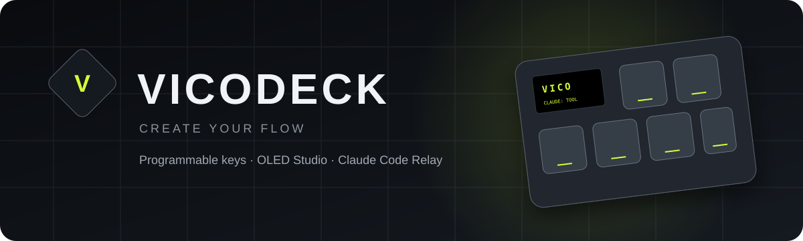
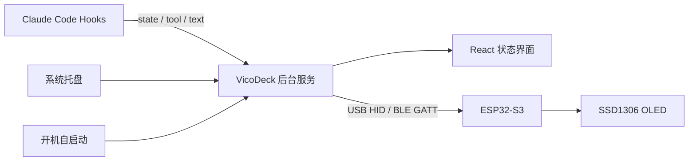

<div align="center">
  

  <br />

  **一款为 Vico 可编程键盘打造的 Windows 桌面控制中心**

  按键映射 · OLED 编辑 · Claude Code 状态转发 · BLE GATT · 后台托盘

  <br />

  [](https://github.com/Apezer/vico-deck/releases/latest)
  [](https://github.com/Apezer/vico-deck/releases/latest)
  [](https://github.com/Apezer/vico-deck/actions)
  [](LICENSE)

  [下载安装包](https://github.com/Apezer/vico-deck/releases/latest/download/VicoDeck-Setup-Windows.exe)
  ·
  [报告问题](https://github.com/Apezer/vico-deck/issues)
  ·
  [GATT 协议](docs/GATT_PROTOCOL.md)
  ·
  [OLED 位图协议](docs/OLED_BITMAP_PROTOCOL.md)
  ·
  [五预设协议](docs/KEY_PROFILE_PROTOCOL.md)
  ·
  [OLED 运行时协议](docs/OLED_RUNTIME_PROTOCOL.md)
</div>

---

## VicoDeck 是什么？

VicoDeck 是 Vico 8 键可编程键盘的桌面配套软件。它把按键、OLED、配置文件和开发者工作流集中在一个界面中，并可在关闭窗口后继续驻留系统托盘。

按键配置页支持 OLED 数字孪生：连接支持协议 v2 的固件后，软件会显示由键盘回传并通过 CRC32 校验的真实 128 × 64 帧，而不是重新绘制一张近似界面。协议细节见 [OLED_TWIN_PROTOCOL.md](docs/OLED_TWIN_PROTOCOL.md)。

与普通键盘配置器不同，VicoDeck 还能监听 **Claude Code** 的工作状态，并通过蓝牙把“正在思考”“正在调用工具”“任务完成”等事件实时发送到 ESP32-S3，最终显示在键盘的 128×64 OLED 上。

## 功能亮点

### 键盘配置

- 2×4、共 8 个可编程按键
- 快捷键、媒体键和系统操作
- 五套固定预设，可分别编辑并同步到键盘 NVS
- OLED 实时页面：Claude Code、CPU/GPU/内存、时钟日期和设备状态
- RGB 灯光工作室：六种灯效、亮度、速度和总开关，通过 USB/BLE 实时同步
- INMP441 按住说话：旋钮按下录音、松开后通过 USB/BLE 发送并调用豆包云端识别
- USB WebHID 与 BLE GATT 共用紧凑运行时状态协议
- Fn + KEY1～KEY5 可在不运行软件时切换 P1～P5
- 通过设备 CRC 自动判断每套预设是否已经同步
- 配置自动保存
- USB WebHID 逐命令确认和原子提交

### OLED Studio

- 128×64、8192 像素的 1-bit 单色屏逐像素预览
- 品牌、Coding、性能、时钟、键盘和自定义像素画六种显示内容
- 使用下拉框切换页面，并与键盘双向同步
- 性能页面实时显示电脑 CPU、GPU 和内存占用
- 自定义像素画支持画笔、橡皮、反相、清空、本地图片导入和手动保存到键盘 NVS
- 1024-byte OLED 帧缓冲分片同步协议
- OLED 亮度设置

### Claude Code Relay

- 监听 Claude Code 生命周期和工具调用
- 捕获 `SessionStart`、`PreToolUse`、`PostToolUse`、`Stop` 等事件
- 通过 localhost 安全传递到 VicoDeck 后台
- 使用 BLE GATT 转发至 ESP32-S3
- 保留最近事件记录

### 语音输入

- 独立语音输入页面，可选择电脑麦克风并通过按钮开始/停止录音
- 电脑麦克风方案不依赖键盘连接或语音固件，也可接收兼容固件发送的录音
- 可在设置中修改全局按住说话快捷键（默认 `Ctrl + Alt + I`）：按下录音、松开识别，并把结果粘贴到原输入框
- 录音期间显示不抢焦点的桌面麦克风悬浮提示；页面内录音按钮仅用于 API 连通测试
- 使用豆包 Seed-ASR 2.0 云端模型，不下载本地 Whisper 模型
- API Key 通过 Electron `safeStorage` 调用 Windows DPAPI 加密保存
- 支持自动标点、数字规整、语义顺滑、复制和导出 TXT
- 支持发送测试状态

### Windows 桌面体验

- 系统托盘后台运行
- 关闭窗口时保持连接
- 可选开机自启动
- 自动恢复已授权的蓝牙设备
- 深色原生风格界面

## 快速开始

### 普通用户

1. 从 [Releases](https://github.com/Apezer/vico-deck/releases/latest) 下载 `VicoDeck-Setup-Windows.exe`。
2. 安装并打开 VicoDeck。
3. 进入左侧 **Claude Code** 页面。
4. 点击 **安装或升级 Claude Code hooks**。
5. 通过 USB 连接键盘，或点击 **选择蓝牙** 连接 BLE GATT 服务。
6. 点击 **发送测试状态**，确认 OLED 收到内容。
7. 新开一个 Claude Code 会话。

> 当前安装包尚未进行商业代码签名，Windows SmartScreen 可能显示未知发布者提示。请只从本仓库 Releases 页面下载。

### Claude Code hooks

VicoDeck 会把自己的 hook 条目合并到：

```text
%USERPROFILE%\.claude\settings.json
```

安装过程不会覆盖已有环境变量、权限配置或第三方 hooks。事件经以下本地端点进入应用：

```text
http://127.0.0.1:38471/claude-status
```

服务只监听回环地址，不对局域网或互联网开放。Hook v3 监听会话、工具、权限请求、
通知、子代理、完成及异常停止事件；新 hooks 从下一次 Claude Code 会话开始生效。
多个 Claude Code 会话会按“等待用户 > 错误 > 工具 > 工作 > 就绪 > 完成”的优先级合并，
十分钟没有任何事件的会话会自动过期，避免 OLED 永久停留在工作状态。

Hook v3 把 PowerShell 脚本路径和事件名写入一条完整命令，兼容会忽略独立 `args`
数组的 Claude Code 2.1.105，也兼容新版 VS Code 扩展。

## 工作原理



Claude Code 状态会编码为固件支持的两个固定 32 字节二进制数据包，分别携带
`state/tool` 和 `text`；BLE 还兼容参考项目使用的紧凑 JSON。逻辑状态包含：

```text
offline / ready / working / tool / waiting / done / error
```

为适配 SSD1306 默认字体，转发到 OLED 的动态文本会清理为短 ASCII 内容。
Coding 页面参考 ESP32C3-Ble-Vico：以大号 Claude 状态和 32×16 图标为主体，
思考时线段围绕图标流动，同时显示当前工具、任务详情、活跃会话数和最近活动时间。

## 兼容固件

VicoDeck 0.2.x 使用以下自定义 BLE GATT 服务：

| 用途 | UUID |
| --- | --- |
| Status Service | `7b6a0001-7c6e-4b3d-9f5f-7669636f0001` |
| RX / Write | `7b6a0002-7c6e-4b3d-9f5f-7669636f0002` |
| TX / Notify | `7b6a0003-7c6e-4b3d-9f5f-7669636f0003` |

设备名称应以 `Vico Keyboard` 开头。协议细节见 [GATT_PROTOCOL.md](docs/GATT_PROTOCOL.md)。

## 本地开发

### 环境要求

- Windows 10/11
- Node.js 20 或更高版本
- npm

### 运行开发环境

```powershell
git clone git@github.com:Apezer/vico-deck.git
cd vico-deck
npm install
npm run dev
```

### 测试与构建

```powershell
npm test
npm run build
npm run dist
```

Windows 安装包会生成在 `release` 目录。

## 技术栈

| 层级 | 技术 |
| --- | --- |
| 桌面运行时 | Electron |
| 用户界面 | React + Vite |
| 设备通信 | Web Bluetooth + WebHID |
| 后台服务 | Node.js HTTP + Electron IPC |
| Claude Code 集成 | Hooks + PowerShell bridge |
| 安装包 | electron-builder + NSIS |
| 固件侧 | ESP32-S3 + NimBLE-Arduino |

## 项目结构

```text
vico-deck/
├─ electron/
│  ├─ main.cjs              # Electron 主进程、托盘和权限
│  ├─ preload.cjs           # 安全 IPC 桥接
│  ├─ claude-monitor.cjs    # Hooks 安装与状态服务
│  ├─ doubao-service.cjs    # 豆包 Seed-ASR 2.0 提交与轮询
│  └─ credential-store.cjs  # Windows DPAPI API Key 存储
├─ src/
│  ├─ App.jsx               # 主界面与应用状态
│  ├─ ClaudePage.jsx        # Claude Code Relay 页面
│  ├─ SpeechPage.jsx        # 电脑/键盘录音、云端配置与识别结果
│  ├─ useRecorder.js        # 电脑麦克风采集与 WAV 编码
│  ├─ voice-protocol.js     # 音频分片、CRC32 与 WAV 封装
│  ├─ device.js             # WebHID / BLE GATT 适配器
│  └─ styles.css            # UI 视觉系统
├─ test/
│  └─ claude-monitor.test.cjs
├─ docs/
│  ├─ GATT_PROTOCOL.md
│  ├─ OLED_BITMAP_PROTOCOL.md
│  └─ KEY_PROFILE_PROTOCOL.md
└─ package.json
```

## 路线图

- [x] 8 键配置界面
- [x] OLED Studio
- [x] 五套可编辑预设
- [x] 托盘与开机自启动
- [x] Claude Code hooks 状态监听
- [x] USB HID / BLE GATT OLED 状态转发
- [x] Claude Code 多会话聚合、权限等待与超时恢复
- [x] 将按键配置写入 ESP32 NVS
- [x] OLED 位图编辑与分片传输协议
- [x] 固件端接收、CRC32 校验并持久化 OLED 位图
- [x] RGB 灯效配置与设备端持久化
- [x] INMP441 按住说话与豆包云端语音识别
- [ ] 固件升级工具
- [ ] macOS 支持
- [ ] 正式代码签名

## 安全与隐私

- Claude Code hook 不会读取 API 密钥或模型响应内容。
- VicoDeck 只接收事件类型、工具名和简短状态文本。
- 本地状态服务仅绑定 `127.0.0.1`。
- 软件不会把状态上传到云端。
- BLE 授权由 Windows 和 Chromium 设备选择器管理。

## 参与贡献

欢迎提交 Issue、功能建议和 Pull Request。提交前请运行：

```powershell
npm test
npm run build
```

## License

VicoDeck 使用 [MIT License](LICENSE) 发布。

---

<div align="center">
  Made for the Vico programmable keyboard.
</div>
